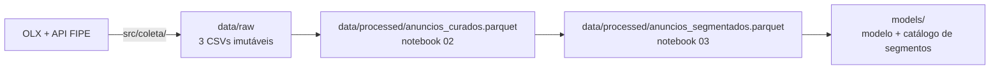

# Fonte de dados

Esta página descreve **de onde vêm os dados** do projeto: a origem, como ela está
organizada, qual é o grão de cada registro e como a carga é reproduzida.

## Origem

Anúncios públicos de veículos usados publicados na OLX Ceará
(`ce.olx.com.br/fortaleza-e-regiao/autos-e-pecas/carros-vans-e-utilitarios`),
obtidos por *scraping* com Playwright (Chromium automatizado) — a OLX bloqueia
requisições HTTP simples (`requests`/`BeautifulSoup`), inclusive o `robots.txt`
retorna 403 sem navegador real.

```
ce.olx.com.br/fortaleza-e-regiao/autos-e-pecas/carros-vans-e-utilitarios/{localizacao}?ps={preco_min}&pe={preco_max}&o={pagina}
```

O coletor que produziu esses dados está **versionado neste repositório**, em
[`src/coleta/`](#o-coletor) — scraper Playwright, casamento com a Tabela FIPE e
montagem do dataset em lote. A camada bruta em `data/raw/` é a cópia imutável
do que esses scripts geraram: os 3 CSVs de `src/coleta/dados/` são
byte-a-byte idênticos aos de `data/raw/`.

!!! warning "Dados sensíveis"
    Os CSVs de `data/raw/` não contêm dado pessoal identificável: a localização é
    limitada a bairro/município (já pública no próprio anúncio da OLX), e não há
    nome, telefone ou qualquer identificador do anunciante.

### Extração vigente

Coleta única, realizada em 21/08/2026 (com 100% dos anúncios detalhados),
complementada em 22/08/2026 com o preenchimento de FIPE via API pública para os
anúncios sem FIPE-OLX. Três arquivos:

| Arquivo | Conteúdo |
|:---|:---|
| `anuncios_listagem.csv` | Dados do card de busca: título, preço, km, cor, motor, tipo, localização, link |
| `anuncios_detalhados.csv` | O mesmo, mais os campos do `dataLayer` da página do anúncio (marca, modelo, versão, câmbio, combustível, carroceria, portas, bairro, município, tipo de vendedor, aceita troca, único dono, FIPE-OLX) |
| `fipe_fallback.csv` | Complemento de FIPE via API pública, só para os anúncios sem FIPE-OLX |

## O coletor

Todo o código que gerou `data/raw/` fica em `src/coleta/`, versionado junto com
o resto do projeto. São três frentes, mais uma ferramenta interativa de apoio.

### 1. Scraping da OLX — `scraper.py`

`buscar_anuncios()` varre as páginas de listagem (uma faixa de preço e uma
localização por vez); `enriquecer_com_detalhes()` abre a página de cada anúncio
e lê o bloco `window.dataLayer` — marca, modelo, versão, câmbio, combustível,
carroceria, portas, bairro, município, tipo de vendedor, aceita troca, único
dono — mais o valor de FIPE que a própria OLX calcula (`fipePrice`). Usa
Chromium via Playwright porque a OLX bloqueia requisição HTTP sem navegador
real (o `robots.txt` retorna 403). A localização (`Fortaleza, CE` → *path* de
URL) é resolvida chamando a API de autocomplete da própria OLX de dentro do
navegador, já autenticado por cookies de sessão.

### 2. Montagem do dataset — `coleta_dataset.py`

Coleta em lote, executada fora do Streamlit. Duas fases, cada uma gravando em
CSV de forma incremental — dá para interromper e retomar sem perder trabalho:

| Fase | Comando | Saída |
|:---|:---|:---|
| Listagem | `python coleta_dataset.py listagem` | `dados/anuncios_listagem.csv` (dados do card de busca) |
| Detalhamento | `python coleta_dataset.py detalhes` | `dados/anuncios_detalhados.csv` (+ campos do `dataLayer` e FIPE-OLX) |

Para contornar o limite de páginas por busca da OLX, varre **10 faixas de preço
fixas** de R$ 5.000 a R$ 250.000, até 5 páginas (250 anúncios) por faixa,
deduplicando por `link`. O detalhamento roda em lotes de 25, gravando a cada
lote, com pausas aleatórias entre requisições (2,5–5 s por anúncio, 20–40 s a
cada 25, 15–30 s entre faixas) — a gravação por lote é o que permitiu pausar e
retomar a coleta várias vezes sem perda de dado (ver *Organização da origem*,
abaixo).

### 3. FIPE faltante — `preenche_fipe_faltantes.py`, `matcher.py`, `fipe_api.py`

Para os anúncios em que a OLX não trouxe FIPE, `matcher.avaliar_anuncio()` casa
marca/modelo/ano por similaridade de texto (`rapidfuzz`, com uma lista de
apelidos de marca) contra a API pública `parallelum.com.br/fipe` e grava o
resultado em `dados/fipe_fallback.csv` (resumível, 1–2,5 s entre chamadas por
causa do limite de requisições da API). Eleva a cobertura de FIPE de 90,7% para
97,1%.

### Ferramenta interativa — `app.py`

`src/coleta/app.py` é um app Streamlit à parte (`streamlit run src/coleta/app.py`)
que busca anúncios na OLX ao vivo dentro de uma faixa de preço e os ranqueia
por desconto sobre a FIPE. Serviu de exploração durante a coleta; **não faz
parte** do pipeline de modelagem, que consome apenas `data/raw/`.

## Organização da origem

A coleta varreu 10 faixas de preço fixas (R$ 5.000 a R$ 250.000) em Fortaleza e
municípios vizinhos, paginando 50 anúncios por página, com deduplicação
incremental por `link` (a coleta foi pausada e retomada várias vezes por queda
de energia/internet, sem perda de dado — grava a cada lote de 25 anúncios).

```
data/raw/
├── anuncios_listagem.csv      (2.565 registros, dados do card de busca)
├── anuncios_detalhados.csv    (2.565 registros, 23 colunas — a base usada nos notebooks)
└── fipe_fallback.csv          (238 registros — só os anúncios sem FIPE-OLX)
```

| Característica | Valor |
|:---|---:|
| Arquivos | 3 |
| Registros (`anuncios_detalhados.csv`) | 2.565 |
| Colunas (`anuncios_detalhados.csv`) | 23 |
| Faixa de preço coletada | R$ 5.000 – R$ 250.000 |
| Período | 21–22/08/2026 (coleta de um único dia) |

## Grão e conteúdo

Cada linha de `anuncios_detalhados.csv` é um **anúncio de veículo usado** à venda
em Fortaleza-CE ou região metropolitana (`link`, chave única).

Dimensões disponíveis: identificação (marca, modelo, versão), características
técnicas (ano, km, câmbio, combustível, carroceria, portas), características
comerciais (preço, tipo de vendedor, bairro/município, aceita troca, único
dono) e metadado de coleta (data). O detalhamento completo de cada coluna está
em [Entendimento dos dados](entendimento-dados.md).

As métricas aditivas são:

| Métrica | Descrição |
|:---|:---|
| `preco` | Preço anunciado, em reais |
| `km` | Quilometragem informada no anúncio |
| `valor_fipe_olx` / `valor_fipe_final` | Valor de referência FIPE, em reais |

## Fluxo de dados no projeto



A carga de `data/raw/` não é reexecutada pelo pipeline de modelagem — a camada
bruta é o ponto de partida, tratada como imutável. O código que a gerou está em
[`src/coleta/`](#o-coletor) e pode ser reexecutado para uma coleta nova. A
partir de `data/raw/`, `src.data.ingestao.carregar_bruto()` lê os 3 CSVs e
mescla o valor de FIPE (idempotente: sempre lê os mesmos arquivos e produz o
mesmo resultado).

## Fontes complementares

| Arquivo | Conteúdo |
|:---|:---|
| `data/raw/fipe_fallback.csv` | Valor de FIPE via API pública (`parallelum.com.br/fipe`), casado por similaridade de texto (marca/modelo/ano) para os anúncios em que a OLX não trouxe FIPE — eleva a cobertura de 90,7% para 97,1% |

## Reprodução

```bash
# 1. (opcional) Refazer a coleta — sobrescreve src/coleta/dados/*.csv.
#    Exige `playwright install chromium`; demorado (horas) e sensível a
#    mudanças no HTML da OLX.
cd src/coleta
python coleta_dataset.py tudo          # listagem + detalhamento
python preenche_fipe_faltantes.py      # FIPE faltante via API pública
# em seguida, copiar os 3 CSVs de src/coleta/dados/ para data/raw/

# 2. Refazer a base curada a partir dos CSVs brutos de data/raw/
uv run invoke preparacao
```

O passo 1 normalmente **não** é executado: `data/raw/` é a coleta congelada de
21–22/08/2026 e o projeto parte dela. Ver [O coletor](#o-coletor).
