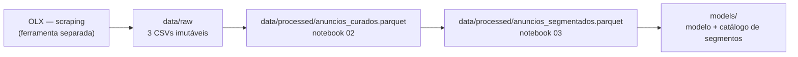

# Fonte de dados

Esta página descreve **de onde vêm os dados** do projeto: a origem, como ela está
organizada, qual é o grão de cada registro e como a carga é reproduzida.

## Origem

Anúncios públicos de veículos usados publicados na OLX Ceará
(`ce.olx.com.br/fortaleza-e-regiao/autos-e-pecas/carros-vans-e-utilitarios`),
obtidos por *scraping* com Playwright (Chromium automatizado) — a OLX bloqueia
requisições HTTP simples (`requests`/`BeautifulSoup`), inclusive o `robots.txt`
retorna 403 sem navegador real.

```
ce.olx.com.br/fortaleza-e-regiao/autos-e-pecas/carros-vans-e-utilitarios/{localizacao}?ps={preco_min}&pe={preco_max}&o={pagina}
```

O coletor (scraper, matcher de FIPE) é um repositório/ferramenta separado deste
projeto (`Software/coleta/` no ambiente de desenvolvimento local do autor) e
**não está versionado neste repositório** — aqui entra apenas o resultado já
materializado em `data/raw/`.

!!! warning "Dados sensíveis"
    Os CSVs de `data/raw/` não contêm dado pessoal identificável: a localização é
    limitada a bairro/município (já pública no próprio anúncio da OLX), e não há
    nome, telefone ou qualquer identificador do anunciante.

### Extração vigente

Coleta única, realizada em 21/08/2026 (com 100% dos anúncios detalhados),
complementada em 22/08/2026 com o preenchimento de FIPE via API pública para os
anúncios sem FIPE-OLX. Três arquivos:

| Arquivo | Conteúdo |
|:---|:---|
| `anuncios_listagem.csv` | Dados do card de busca: título, preço, km, cor, motor, tipo, localização, link |
| `anuncios_detalhados.csv` | O mesmo, mais os campos do `dataLayer` da página do anúncio (marca, modelo, versão, câmbio, combustível, carroceria, portas, bairro, município, tipo de vendedor, aceita troca, único dono, FIPE-OLX) |
| `fipe_fallback.csv` | Complemento de FIPE via API pública, só para os anúncios sem FIPE-OLX |

## Organização da origem

A coleta varreu 10 faixas de preço fixas (R$ 5.000 a R$ 250.000) em Fortaleza e
municípios vizinhos, paginando 50 anúncios por página, com deduplicação
incremental por `link` (a coleta foi pausada e retomada várias vezes por queda
de energia/internet, sem perda de dado — grava a cada lote de 25 anúncios).

```
data/raw/
├── anuncios_listagem.csv      (2.565 registros, dados do card de busca)
├── anuncios_detalhados.csv    (2.565 registros, 23 colunas — a base usada nos notebooks)
└── fipe_fallback.csv          (238 registros — só os anúncios sem FIPE-OLX)
```

| Característica | Valor |
|:---|---:|
| Arquivos | 3 |
| Registros (`anuncios_detalhados.csv`) | 2.565 |
| Colunas (`anuncios_detalhados.csv`) | 23 |
| Faixa de preço coletada | R$ 5.000 – R$ 250.000 |
| Período | 21–22/08/2026 (coleta de um único dia) |

## Grão e conteúdo

Cada linha de `anuncios_detalhados.csv` é um **anúncio de veículo usado** à venda
em Fortaleza-CE ou região metropolitana (`link`, chave única).

Dimensões disponíveis: identificação (marca, modelo, versão), características
técnicas (ano, km, câmbio, combustível, carroceria, portas), características
comerciais (preço, tipo de vendedor, bairro/município, aceita troca, único
dono) e metadado de coleta (data). O detalhamento completo de cada coluna está
em [Entendimento dos dados](entendimento-dados.md).

As métricas aditivas são:

| Métrica | Descrição |
|:---|:---|
| `preco` | Preço anunciado, em reais |
| `km` | Quilometragem informada no anúncio |
| `valor_fipe_olx` / `valor_fipe_final` | Valor de referência FIPE, em reais |

## Fluxo de dados no projeto



A carga de `data/raw/` não é reexecutada por este repositório — é o ponto de
partida, tratado como imutável. A partir dela, `src.data.ingestao.carregar_bruto()`
lê os 3 CSVs e mescla o valor de FIPE (idempotente: sempre lê os mesmos arquivos
e produz o mesmo resultado).

## Fontes complementares

| Arquivo | Conteúdo |
|:---|:---|
| `data/raw/fipe_fallback.csv` | Valor de FIPE via API pública (`parallelum.com.br/fipe`), casado por similaridade de texto (marca/modelo/ano) para os anúncios em que a OLX não trouxe FIPE — eleva a cobertura de 90,7% para 97,1% |

## Reprodução

```bash
# Refaz a base curada a partir dos CSVs brutos (data/raw é imutável e não é
# recriado — a coleta em si roda numa ferramenta separada)
uv run invoke preparacao
```
