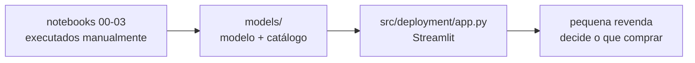

# Implementação

Um resultado só é útil quando quem decide consegue acessá-lo. Esta página descreve **como a
entrega chega ao usuário**, como ela é mantida em funcionamento e como o projeto é encerrado.

## Plano de implantação

A entrega é uma aplicação Streamlit local (`src/deployment/app.py`) — escolhida
por não exigir infraestrutura de servidor nem custo de hospedagem, adequada ao
porte de uma pequena revenda que quer consultar o resultado sem depender de
serviço externo.

| Entrega | Consumidor | Meio | Frequência |
|:---|:---|:---|:---|
| Classificação de anúncio, catálogo, oportunidades comerciais e mapa filtrável | Pequena revenda (cenário do Canvas) | Aplicação Streamlit local | Sob demanda |
| Documentação do processo (esta publicação) | Quem avalia/revisa o projeto | Site MkDocs | Estática, atualizada a cada revisão |

A atualização é **manual**: rodar `uv run invoke notebooks` (ou os notebooks
individualmente) regrava `models/modelo-segmentacao.joblib`,
`models/catalogo_de_segmentos.json` e `data/processed/anuncios_segmentados.parquet`;
a aplicação lê esses três arquivos a cada inicialização (com
`st.cache_resource`/`st.cache_data`, então precisa ser reiniciada para pegar um
modelo novo).

## Monitoramento e manutenção

Não há pipeline de dados novo chegando automaticamente — a coleta é manual e
pontual (ver [Fonte dos dados](fonte-dados.md)). O que se aplica, num projeto
deste porte:

| O que monitorar | Como | Periodicidade | Ação se desviar |
|:---|:---|:---|:---|
| A aplicação carrega o modelo sem erro | `uv run invoke test` (smoke test) antes de cada uso | a cada atualização de código | corrigir antes de publicar |
| Os notebooks executam do início ao fim sem quebrar | `uv run invoke notebooks` | antes de qualquer entrega | corrigir a célula que falhou |
| A silhueta do modelo se mantém ≥ 0,40 numa coleta nova | recomparar contra `models/catalogo_de_segmentos.json` | se e quando houver nova coleta | reavaliar o número de segmentos e o espaço de atributos (repetir a seção de sensibilidade) |

Não há alerta automatizado nem plantão — o autor é o único responsável, e o uso
é sob demanda, não em produção contínua.

### Retreinamento

Não há calendário de retreinamento. Se uma nova coleta for feita no futuro, o
modelo deve ser retreinado do zero (não incrementalmente): rodar
`03-modelagem.ipynb` de novo sobre a base curada atualizada, repetindo a etapa
de sensibilidade ao espaço de atributos — a composição do mercado pode mudar o
suficiente para alterar qual espaço separa melhor os grupos.

## Relatório final

| Artefato | Local |
|:---|:---|
| Relatório final (esta documentação) | `docs/` (publicado via MkDocs) |
| Notebooks completos, com saída | `notebooks/00-dicionario-dados.ipynb` a `03-modelagem.ipynb` |
| Aplicação | `src/deployment/app.py` |

Não há apresentação de fechamento separada — a documentação em `docs/` cumpre
esse papel.

## Revisão do projeto

- **O que deu certo** — separar claramente o que é "falha de captura do
  scraper" do que é "ausência real de negócio" evitou tanto descartar dado
  bom (as duas variáveis opcionais que o Canvas pede) quanto manter dado ruim
  (os 62 anúncios sem nenhum campo estruturado).
- **O que poderia ter sido melhor** — a decisão de usar one-hot nas nominais
  poderia ter sido testada mais cedo, antes de treinar o primeiro modelo
  completo; teria economizado uma iteração de retreino.
- **O que fazer diferente** — em um próximo projeto, rodar a comparação de
  espaços de atributos (numérico × misto) como primeira coisa da modelagem,
  não como reação a um resultado ruim.

Manutenção e ponto de contato após o encerramento: Venicios
(venicios1997@gmail.com) — projeto individual, sem equipe a transferir.
