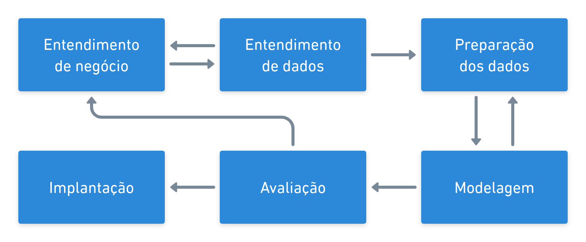
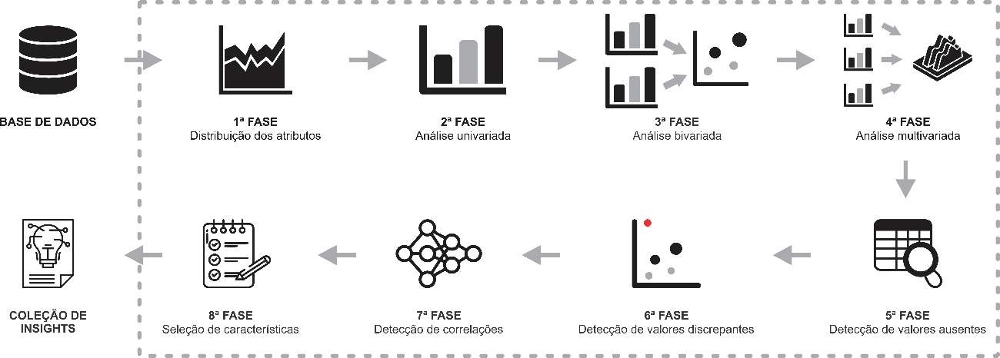

# Metodologia

O projeto segue o **CRISP-DM** (*Cross-Industry Standard Process for Data Mining*), o
processo padrão de projetos de mineração de dados e a metodologia adotada pela
disciplina. Esta página não reapresenta a teoria do CRISP-DM: ela registra **o que
cada fase produziu neste projeto** e aponta onde o resultado está documentado.

## As sete fases, neste projeto

| Fase | O que foi feito aqui | Onde está |
|:--|:---|:---|
| **1. Entendimento de negócio** | Canvas do Problema de uma pequena revenda de Fortaleza: a dor (capital parado em carro de baixa procura), a decisão a apoiar (o que comprar para estoque) e os critérios de aceite verificáveis | [Canvas do Problema](canvas-do-problema.md), [Entendimento de negócio](entendimento-negocio.md), [Critérios de sucesso](criterios-sucesso.md) |
| **2. Entendimento dos dados** | Coleta de 2.565 anúncios da OLX (Playwright, código em `src/coleta/`) e mesclagem da FIPE; dicionário das 23 colunas brutas; roteiro de 8 etapas de EDA | [Fonte dos dados](fonte-dados.md#o-coletor), [Entendimento dos dados](entendimento-dados.md), [Análise exploratória](analise-exploratoria.md) |
| **3. Preparação dos dados** | Dez regras de limpeza, cada uma com motivo e volume afetado; base curada de 2.418 anúncios e atributos derivados | [Preparação dos dados](preparacao.md) |
| **4. Modelagem** | Teste do espaço de atributos (numérico × misto) antes de fixar o desenho; quatro algoritmos comparados por validação cruzada; K-Means com k=4 | [Modelagem dos dados](modelagem.md) |
| **5. Avaliação** | Confronto com os dez critérios de aceite, revisão do processo e decisão de seguir para implantação | [Avaliação dos resultados](avaliacao.md) |
| **6. Implantação** | Aplicação Streamlit local que classifica um anúncio novo sem retreinar nada, mais o plano de monitoramento | [Implementação](implementacao.md) |
| **7. Acompanhamento** | Registro do andamento das fases | [Status do projeto](status.md) |

!!! note "Sobre a ordem das fases"
    O CRISP-DM é cíclico, não linear. Este projeto voltou de Modelagem para
    Preparação **duas vezes**: a primeira quando a comparação de espaços de
    atributos mostrou que o one-hot das nominais derrubava a silhueta; a segunda
    quando o perfil dos segmentos revelou um grupo inteiro formado por
    quilometragem implausível, que virou regra de limpeza. As duas idas e voltas
    estão registradas em [Avaliação dos resultados](avaliacao.md#revisao-do-processo),
    porque o caminho até o resultado é parte do resultado.

## Análise exploratória

A EDA segue um roteiro de **8 etapas**, aplicado sobre as duas numéricas do espaço de
atributos, as nove nominais e as três variáveis reservadas.

| # | Etapa | O que responde |
|:-:|:---|:---|
| 1 | Distribuição dos atributos | como a base se compõe antes de qualquer ajuste? |
| 2 | Análise univariada | como cada variável se distribui isoladamente? |
| 3 | Análise bivariada | quais eixos de negócio separam preço, km e ano? |
| 4 | Análise multivariada | quais categorias nominais andam juntas? |
| 5 | Valores ausentes | onde falta dado — e é falha de captura ou ausência real? |
| 6 | Valores discrepantes | há valor implausível em preço, km, ano ou FIPE? |
| 7 | Correlação | quais variáveis são redundantes entre si? |
| 8 | Seleção de características | o que entra no espaço de atributos, e por quê? |

Duas etapas do roteiro **não se aplicam** a esta base e por isso ficam de fora, com o
motivo registrado: características **ordinais** (nenhuma variável declara escala
ordenada) e características de **tempo** (`data_coleta` tem um único valor distinto —
a coleta foi de um dia só). O detalhamento de cada etapa está em
[Análise exploratória](analise-exploratoria.md).

## Tecnologia e ferramentas

A pilha completa, com a função de cada peça, está em
[Entendimento de negócio — Requisitos técnicos](entendimento-negocio.md#requisitos-tecnicos).
Em resumo: Python 3.12 gerenciado com `uv`, Playwright para o scraping da OLX
(coletor em `src/coleta/`, ver [Fonte dos dados](fonte-dados.md#o-coletor)),
JupyterLab para os notebooks, scikit-learn para a clusterização, MkDocs Material
para esta documentação e Streamlit para a aplicação de implantação. Tudo
gratuito e executado localmente.
