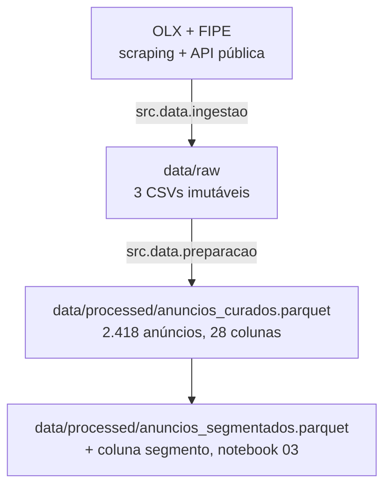

# Preparação dos dados

Esta página descreve **o que foi feito com os dados** entre a origem e a análise: como eles
são materializados, que regras de limpeza foram aplicadas e como a transformação é
conferida.

## Arquitetura em camadas



| Camada | Diretório | Papel |
|:---|:---|:---|
| Bruta | `data/raw` | cópia imutável da coleta (3 CSVs) |
| Curada | `data/processed/anuncios_curados.parquet` | colunas limpas, ausência tratada, atributos derivados |
| Segmentada | `data/processed/anuncios_segmentados.parquet` | a curada + coluna `segmento` (saída da modelagem) |

## Materialização da camada bruta

`data/raw/` já é o resultado da coleta (ver [Fonte dos dados](fonte-dados.md)) —
não há passo de cópia/particionamento adicional neste repositório. A leitura é
feita por `src.data.ingestao.carregar_bruto()`, que lê os 3 CSVs e mescla o
valor de FIPE; é idempotente (sempre lê os mesmos arquivos de entrada e produz
o mesmo resultado — não há efeito colateral em disco na leitura).

## Regras de limpeza

Implementadas em `src/data/preparacao.py` (lista `REGRAS_LIMPEZA`, publicada
programaticamente — o notebook e o módulo compartilham a mesma fonte) e
narradas célula a célula em `02-ajustes-dados.ipynb`.

| # | Regra | Motivo |
|:-:|:---|:---|
| 1 | Remover anúncios com `link` duplicado | 5 links aparecem duas vezes — falha pontual na dedupe incremental da coleta, não dois anúncios distintos |
| 2 | Remover anúncios com falha total do bloco `dataLayer` | 62 anúncios têm as 7 colunas núcleo vazias ao mesmo tempo — falha de captura do scraper, não ausência real |
| 3 | Remover o anúncio sem `ano` | 1 registro; `ano` não tem substituto plausível |
| 4 | Remover o registro com `km = 999.998` | valor de preenchimento/erro de digitação, não corrigível por comparação com outra coluna |
| 5 | Rotular `NaoInformado` a ausência real e opcional (câmbio, combustível, carroceria, portas, aceita_troca, único_dono, bairro, cor, motor, tipo) | ausência legítima e baixa (até 25,7%) — categoria explícita, nenhum valor inventado |
| 6 | Derivar `idade_veiculo`, `km_por_ano`, `zero_km` e `desconto_fipe_pct` | idade na data da coleta e intensidade de uso separam veículos melhor que o ano absoluto sozinho |
| 7 | Remover `km` < 1.000 em veículos com mais de 5 anos | 61 anúncios declaram menos de 1.000 km em carros de 6 a 44 anos — 14 km rodados por ano na mediana. É quilometragem digitada em milhares ou campo não preenchido, e sem a regra eles formam um segmento inteiro na clusterização |
| 8 | Anular `desconto_fipe_pct` fora de ±60% | razão sem limite inferior (o mínimo bruto é −1.249%) alimentada por FIPE casada por similaridade de texto. Só o **valor** sai; o anúncio permanece, porque a coluna é reservada e o defeito está na referência de preço, não no veículo |
| 9 | Remover valores além de 3×IQR em `ano`/`km` | a cerca clássica de Tukey (1,5×IQR) alcançaria carros antigos/alta km genuínos — o segmento que a clusterização precisa isolar, não descartar |
| 10 | Descartar colunas concentradas acima de 99% num único valor | não separam nada; a única que passa do limiar é `data_coleta` (coleta de um único dia), que já não fazia parte do espaço de atributos |

Um limiar único de ausência (>5% → descarta coluna) descartaria `aceita_troca`
e `unico_dono`, duas variáveis que o Canvas do Problema pede — elas têm **27,4%
e 18,7% de ausência na base bruta** (2.565 anúncios) e **25,7% e 16,7% no ponto
do funil em que a decisão é tomada** (2.496 anúncios, depois das remoções por
duplicidade e falha de captura). Cada natureza de ausência recebe o tratamento
que ela pede — falha de captura vira remoção de linha; ausência opcional vira
categoria.

### O funil da curadoria

| Etapa | Registros | Removidos |
|:---|--:|--:|
| Base bruta | 2.565 | — |
| `link` duplicado | 2.560 | 5 |
| Falha total do `dataLayer` | 2.498 | 62 |
| Sem `ano` | 2.497 | 1 |
| `km` = 999.998 | 2.496 | 1 |
| Hodômetro implausível | 2.435 | 61 |
| Extremos além de 3×IQR | **2.418** | 17 |


*Quantos anúncios saem em cada bloco. Tabela-fonte:
`reports/tables/ajustes-dados/funil-da-curadoria.csv`.*

A regra de desconto fora de faixa não aparece no funil porque **não remove
linha nenhuma**: ela anula 42 leituras de `desconto_fipe_pct`, estreitando a
faixa de −1.249,1%…78,8% para −56,8%…59,9%.


*Ausência separada entre falha de captura e ausência real e opcional — as duas
recebem tratamentos diferentes. Tabela-fonte:
`reports/tables/ajustes-dados/ausencia-por-natureza.csv`.*

## Conferências

- **Nulos no espaço de atributos** — `assert` no notebook: 0 células vazias
  fora da FIPE reservada (que mantém ~2,5% de nulo, deliberadamente);
- **Equivalência com o pipeline** — `preparacao.construir_base_curada()` roda
  de novo dentro do próprio notebook e é comparada célula a célula com o
  resultado narrado; o notebook confirma "Sem divergência" antes de gravar;
- **Assimetria** — `dic.ASSIMETRICAS = ["km"]` conferido contra a assimetria
  medida na base curada (0,94 para `km`; `ano` chega a −1,19 mas com sinal
  negativo, e `log1p` só corrige cauda à direita);
- **Funil de remoção** — a figura acima mostra quantos anúncios saem em cada bloco.

## Agregados

Não há agregado por objetivo de negócio nesta fase — o grão permanece
"um registro por anúncio" do início ao fim do pipeline. O único artefato
adicional é a matriz de modelagem (`data/processed/matriz_modelagem.parquet`),
um recorte de colunas da base curada, sem agregação:

| Agregado | Objetivo | Grão |
|:---|:-:|:---|
| `matriz_modelagem.parquet` | 1 | anúncio (mesmo grão da base curada, só com as colunas do espaço de atributos + reservadas) |

## Tratamento de outliers

Valores extremos em `ano`/`km` são reais, não erro de cadastro — por isso o
corte usa 3×IQR (não 1,5×): a cerca clássica de Tukey marcaria 3,5%/2,4% da
base e removeria justamente o segmento de carros antigos/alta quilometragem
que a segmentação existe para isolar como grupo à parte.


*Os dois critérios lado a lado — só o de 3×IQR é aplicado. Tabela-fonte:
`reports/tables/ajustes-dados/discrepantes-dois-criterios.csv`.*

**Extremo real ≠ valor implausível.** As duas regras novas (hodômetro e
desconto) não contradizem essa decisão: elas não cortam por distância da
mediana, e sim por **combinação impossível** — um carro não roda 14 km por ano,
e um anúncio não é vendido a 13× a tabela FIPE. Um Fusca de 1975 com 300 mil km
é extremo e verdadeiro, e continua na base. Detalhe completo em
[Modelagem dos dados](modelagem.md#pre-processamento).


*Assimetria de cada numérica depois da curadoria — é o que decide onde o
`log1p` se aplica. Tabela-fonte:
`reports/tables/ajustes-dados/assimetria-apos-ajustes.csv`.*

## Reprodução

```bash
# refaz a base curada e a matriz de modelagem a partir de data/raw
uv run invoke preparacao
```
