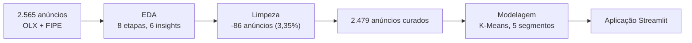

# Relatório final

Consolidação do projeto ponta a ponta, do problema de negócio à aplicação. As
páginas técnicas de cada fase têm o detalhe; este relatório é a leitura única,
para quem quer a história inteira sem navegar pelas 13 páginas anteriores.

## O problema

Uma pequena revenda de veículos usados de Fortaleza-CE decide o que comprar
para estoque com base em intuição, não em dado de mercado — o que gera capital
parado em carros de baixa procura e oportunidades perdidas em segmentos com
mais potencial. O projeto respondeu, com dados reais e não hipotéticos:

> **Quais tipos de veículos uma pequena revenda deveria priorizar para compra e
> revenda em Fortaleza?**

Contexto completo, com a dor, os riscos e as 5 perguntas orientadoras, em
[Canvas do Problema](canvas-do-problema.md).

## Os dados

2.565 anúncios de carros usados em Fortaleza e municípios vizinhos, coletados
da OLX em 21/08/2026 (scraping com Playwright), com o valor de referência da
Tabela FIPE mesclado de duas fontes (a própria OLX, 90,7% de cobertura; API
pública, elevando para 97,1%). Volume dentro da meta do Canvas (1.000 a 5.000
anúncios). Detalhe em [Fonte dos dados](fonte-dados.md) e
[Entendimento dos dados](entendimento-dados.md).

## O que foi feito com os dados

- **Análise exploratória** (`01-analise-exploratoria.ipynb`) — roteiro de 8
  etapas, 6 achados registrados (o mais relevante: `preco` e `valor_fipe_final`
  correlacionam 0,98, confirmando que a FIPE deveria ficar reservada da
  modelagem). Coleção completa em
  [Análise exploratória — Insights](analise-exploratoria.md#colecao-de-insights).
- **Preparação** (`02-ajustes-dados.ipynb`) — 14 ajustes registrados, cada um
  com motivo e volume afetado: 5 duplicados reais removidos, 62 anúncios com
  falha de captura do scraper removidos, 1 valor de `km` claramente inválido
  removido, ausência real (câmbio, combustível, aceita_troca...) virou
  categoria explícita em vez de descartar linha ou coluna, e 17 valores
  extremos além de 3×IQR removidos — preservando deliberadamente os carros
  antigos e de alta quilometragem genuínos. Resultado: **2.479 anúncios**
  curados (2.565 → 2.479, −3,35%). Detalhe em
  [Preparação dos dados](preparacao.md).

## A modelagem

O achado metodológico central do projeto: **o espaço de atributos importa mais
que o algoritmo**. Uma primeira tentativa com todas as 9 variáveis categóricas
em one-hot (106 dimensões) produzia silhueta de apenas ~0,10 — a distância
euclidiana era dominada por dummies esparsas, não pelo perfil real do veículo.
Testando o espaço numérico enxuto (`ano`, `km`, `zero_km` — 3 dimensões) contra
o mesmo critério, a silhueta saltou para ~0,54. Essa comparação, feita
explicitamente antes de fixar a modelagem, está em
[Modelagem dos dados — Sensibilidade ao espaço de atributos](modelagem.md#sensibilidade-ao-espaco-de-atributos).

**Modelo final:** K-Means, `n_clusters=5`, escolhido por validação cruzada
(`ShuffleSplit`) entre 4 algoritmos (K-Means, MiniBatch K-Means, Bisecting
K-Means, Birch).

| Métrica | Valor | Critério de aceite |
|:---|---:|:---|
| Silhueta | **0,542** | ≥ 0,40 ✅ |
| Davies-Bouldin | 0,543 | quanto menor, melhor |
| Calinski-Harabasz | 6.670 | quanto maior, melhor |
| Número de segmentos | **5** | entre 4 e 8 ✅ |
| Menor segmento | 60 anúncios (2,4%) | ≥ 50 anúncios ✅ |

As variáveis categóricas (marca, câmbio, carroceria, tipo de vendedor) **não**
entraram no algoritmo — mas continuam decisivas na leitura de negócio abaixo,
e uma validação externa contra `bairro` (que também nunca entrou na
modelagem) confirma que os segmentos capturam padrão real de geografia de
mercado, não artefato do algoritmo.

## Os 5 segmentos

| Segmento | Perfil | % da base | Preço mediano | Km mediana | Idade mediana | Marca típica | Desconto vs. FIPE |
|:-:|:---|---:|---:|---:|---:|:---|---:|
| 3 | Populares usados | 41,5% | R$ 41.900 | 117.000 | 12 anos | Chevrolet | **+3,0%** |
| 2 | Seminovos recentes | 41,1% | R$ 99.495 | 43.953 | 2 anos | Fiat | −0,6% |
| 0 | Populares antigos | 11,5% | R$ 14.995 | 163.000 | 24 anos | Volkswagen | −8,3% |
| 1 | Zero km / novos (elétricos e híbridos) | 3,4% | R$ 149.990 | 0 | 0 anos | BYD | −6,0% |
| 4 | Antigos de baixíssima km (nicho) | 2,4% | R$ 24.950 | 200 | 16,5 anos | Fiat | −25,4% |

Tabela completa e gráfico preço × km em
[Avaliação dos resultados](avaliacao.md) e
`reports/tables/modelagem/perfil-dos-segmentos.csv`.

## As oportunidades comerciais (Pergunta 5 do Canvas)

O **segmento 3** (populares usados, 41,5% da base — o maior segmento) é o
único com desconto médio **positivo** em relação à FIPE (+3,0%): a maior fatia
do mercado está, em média, sendo anunciada abaixo do valor de referência —
maior potencial de compra vantajosa para revenda, com o menor risco de capital
parado (é o segmento com mais anúncios comparáveis). O segmento 2 (seminovos
recentes) vem em seguida, com ágio de apenas 0,6% — quase neutro.

Nas pontas opostas: o segmento 4 (carros antigos de baixíssima km) tem ágio
médio de 25,4% — provavelmente valorizado por raridade/estado de conservação,
não um bom alvo de compra pelo critério de desconto; e o segmento 1
(zero-km/elétricos) exige o maior capital por unidade (R$ 150 mil medianos),
com participação pequena (3,4%) — coerente com a recomendação do próprio
Canvas do Problema de que segmentos premium tendem a baixa prioridade para uma
revenda de capital limitado.

## A aplicação

`src/deployment/app.py` — Streamlit local, sem chamada de rede, que carrega o
pipeline treinado (`models/modelo-segmentacao.joblib`) e o catálogo de
segmentos. Três funcionalidades: classificar um anúncio novo (ano + km),
consultar o catálogo de segmentos com a leitura de oportunidade, e visualizar
o mapa preço × km colorido por segmento. Detalhe em
[Implementação](implementacao.md).

## Limitações declaradas

- O projeto mede **oferta** (anúncios), não demanda efetiva nem preço de
  venda realizado — o desconto vs. FIPE é uma leitura de intenção de venda,
  não de transação fechada.
- A coleta é de **um único dia** (21/08/2026) — os resultados retratam o
  mercado nesse momento, não uma tendência.
- Duas variáveis do Canvas (`marca`, `município`) têm cauda longa e foram
  agrupadas (categorias raras → `Outras`) antes de qualquer uso em one-hot.

Detalhamento completo em [Entendimento dos dados — Limitações](entendimento-dados.md#limitacoes).

## Resposta à pergunta central e à hipótese

> **Pergunta central:** Quais segmentos de veículos usados apresentam
> características semelhantes no mercado de Fortaleza e como essa segmentação
> pode apoiar a decisão de aquisição de estoque de uma pequena revenda?

**Resposta:** cinco segmentos, definidos primariamente por idade e
quilometragem do veículo, com perfis de marca/carroceria/câmbio distintos e
leituras de desconto vs. FIPE que variam de +3,0% a −25,4%. Uma revenda de
capital limitado tem, nesses números, um critério objetivo para priorizar o
segmento 3 (populares usados) — maior volume de mercado e único com desconto
médio positivo — em vez de depender só de intuição.

> **Hipótese de negócio:** a identificação de segmentos de veículos por meio
> de técnicas de aprendizado de máquina não supervisionado pode revelar
> padrões do mercado que auxiliem pequenas revendas a direcionar seus
> recursos para grupos de veículos mais adequados à sua estratégia de estoque.

**Confirmada.** Os 10 critérios de aceite dos 3 objetivos de negócio foram
atendidos (ver [Critérios de sucesso](criterios-sucesso.md) e
[Avaliação dos resultados](avaliacao.md)), e o achado metodológico central —
que o espaço de atributos escolhido muda a silhueta em 5× — não estava
previsto no Canvas original e só apareceu porque o experimento testou, em vez
de presumir, qual leitura dos dados o algoritmo deveria consumir.
